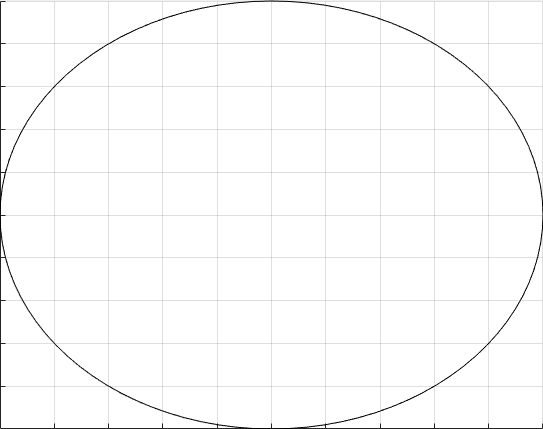
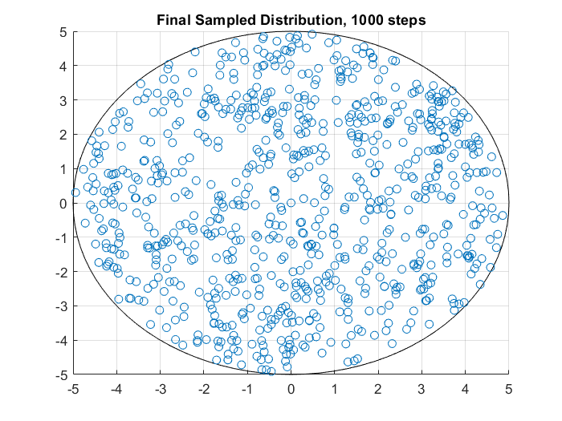

# Hit-And-Run
This repo contains MATLAB implementations of a "Hit And Run" Markov Chain Monte Carlo (MCMC) method. The code provided samples a uniform distribution over a circular body. However, it is guaranteed to work over any convex body, and only the intersection function would have to be modified in order to change the convex body. The sampled distribution can also be modified, of course.

Running the algorithm for 10 steps yields the following:

Over a large number of steps, this sampling method should approach the distribution.

# <b>The Hit And Run Algorithm</b>

First, some definitions:
If f is the distribution we are sampling from, and S is the convex body we are sampling over, then:
 is the measure induced by f on , where p is any point on , and u is a unit vector parallel to .

 is the restriction of f to .

This algorithm iterates over the following two steps:
  1) Pick a uniformly distributed random line  through the current point
  2) Move to a random point along l chosen from the distribution  [[1]](#1).

## References
<a id="1">[1]</a> 
Laszlo Lovasz, Santosh Vempala (2003). 
Hit-and-Run is Fast and Fun.
Technical Report MSR-TR-2003-05
